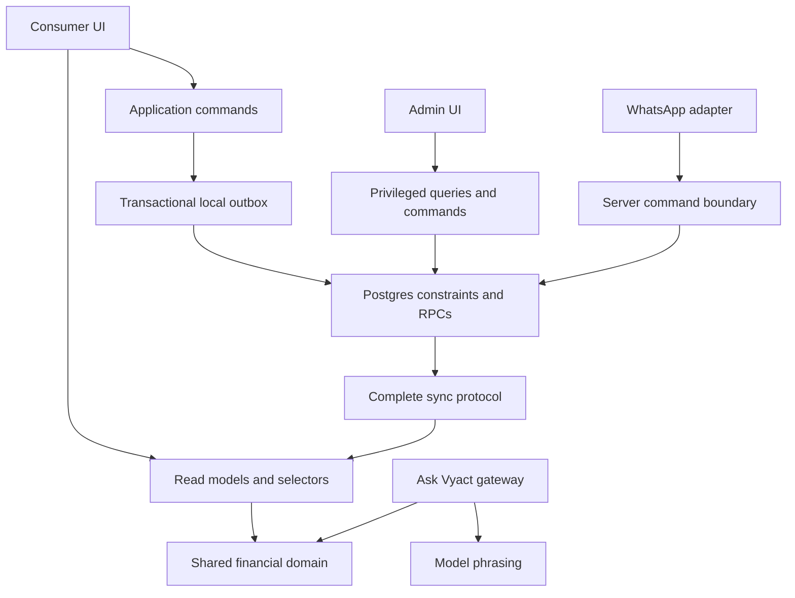

# Vyact engineering audit

**Audit date:** 2026-09-07  
**Consumer version reviewed:** 10.20.0  
**Admin version reviewed:** 1.3.1  
**Status:** Source-level review; findings require the validation described below.  
**Purpose:** Review and decision-making snapshot of the audit findings. This document does not replace the authoritative [technical debt register](TECH_DEBT.md).

**Assessment:** Vyact has a sensible technology stack and several strong engineering foundations, but its implementation has outgrown some of its original contracts. The main concern is not React code style or the choice of Supabase. It is **consistency between financial models, persistence behavior, authorization rules, and what the UI promises**.

**Recommendation: retain the stack, but prioritize a stabilization release before expanding financial features or enabling more automated ingestion. A wholesale rewrite is not justified.**

---

## 1. Scope and confidence

This was a **read-only, source-level audit** covering:

- Consumer routing, state management, financial calculations, forms, adapters, sync, authentication, and responsive primitives.
- Admin authentication, permissions, data access, settings, dashboard, and tests.
- Supabase schema migrations, RLS policies, RPCs, Edge Functions, and account lifecycle.
- Ask Vyact’s classification, computation, model transport, output validation, and metering.
- WhatsApp ingestion and split-sharing infrastructure.
- Public content rendering, deployment configuration, and CI/test coverage.

### Important limitations

- No builds, tests, browser sessions, database queries, or production probes were run during the audit.
- VS Code reported no current diagnostics. That does **not** establish runtime correctness.
- Database findings describe the schema represented by committed migrations. Effective production grants, configuration, and migration state must be verified.
- This is a broad, risk-focused audit—not a claim that every file has been exhaustively reviewed.
- Source links reflect the files reviewed at audit time; line positions may change as fixes are implemented.

### Overall assessment

| Area | Assessment |
|---|---|
| Stack selection | Appropriate; retain |
| Consumer organization | Improving, but boundaries remain porous |
| Financial correctness | Requires immediate attention |
| Offline/sync reliability | Good intent; material concurrency gaps |
| Database authorization | RLS foundation exists; important policy gaps |
| Admin operational readiness | Behind the consumer |
| Responsive implementation | Good primitives; incomplete accessibility and validation |
| AI architecture | Useful separation, but safety guarantees are overstated |
| Release governance | Tests exist, but deployment is not gated by them |
| Documentation | Significant contradictions with current code |

---

## 2. What is working well

These are assets to preserve, not replace.

### A. React + Vite + Supabase is a suitable architecture

A client-rendered application is appropriate for authenticated household finance. Supabase provides transactions, relational constraints, authentication, and RLS without requiring a large custom backend.

There is no demonstrated reason to introduce microservices, a separate Node API for every CRUD operation, or a full Next.js migration.

Public educational content already has a separate server-rendered surface in [react/api/learn.js](react/api/learn.js). That is a reasonable distinction between authenticated application UX and crawlable public content.

### B. The financial domain has explicit invariants

Transfer neutrality, investment neutrality, reconciliation offsets, and EMI decomposition are documented and represented in tests.

The [money-model invariant suite](react/src/lib/__tests__/moneyModel.invariants.test.ts) is particularly valuable.

However, **the tests currently prove selected calculations more effectively than they prove complete user workflows**. Several findings below are failures between individually reasonable layers.

### C. Budget identity is correctly pushed toward the database

The atomic parent-plus-allocation RPC is the right pattern:

[Atomic budget write](supabase/migrations/20260621120000_upsert_budget_with_allocations.sql#L14-L53)

Database-owned identity and transactional writes are much safer than coordinating uniqueness through browser-generated identifiers.

### D. Consumer code splitting and state decomposition are sensible

- Pages and global forms are lazy-loaded in [react/src/App.tsx](react/src/App.tsx#L18-L50).
- The store composition root is small and explicit in [react/src/store/index.ts](react/src/store/index.ts).
- Components generally subscribe to selected state rather than the entire store.

These are good directions. The next improvement should be **clearer domain contracts**, not merely smaller files.

### E. Responsive forms have a useful shared foundation

`HalfSheet` provides:

- One form instance across breakpoints.
- A portal that escapes stacking contexts.
- Mobile bottom-sheet presentation.
- Desktop dialog presentation.
- Scroll containment and a safe-area-aware footer.

See [react/src/components/ui/HalfSheet.tsx](react/src/components/ui/HalfSheet.tsx).

### F. AI provider credentials are server-side

The browser calls an authenticated Edge Function rather than directly holding a provider credential.

There are also useful pure-module tests and client/server money parity tests. Those are worth retaining while tightening the actual safety boundaries.

---

## 3. Highest-priority financial and persistence findings

### F1. Editing account metadata can erase balance and reconciliation data

**Priority: immediate—data-loss risk.**  
**Confidence: directly supported by code.**

The account editor constructs a new payload containing name, kind, currency, flags, and `assetId`, but omits:

- `openingBalance`
- `reconciliationOffset`
- `reconciliationLog`
- Provenance fields

See the [account save payload](react/src/components/accounts/AccountFormModal.tsx#L97-L121).

The cloud mapper then defaults omitted financial fields to zero and an empty log:

[Account row mapper](react/src/lib/supabaseAdapter.ts#L343-L355)

The local adapter also replaces the existing record with the supplied object rather than merging a patch:

[Local upsert implementation](react/src/lib/dataAdapter.ts#L223-L234)

**Consequence:** renaming or archiving an account can reset its opening balance and reconciliation history.

#### Required change

Separate these operations:

- Create account.
- Update account metadata.
- Reconcile account.
- Change account classification.

A metadata update must not contain, default, or overwrite financial state.

**Acceptance test:** reconcile an account, rename it, reload from cloud, and verify that its balance, offset, history, and provenance remain unchanged.

### F2. The transaction form bypasses the EMI system-split branch

**Priority: before the next financial-feature release.**  
**Confidence: directly supported by code.**

The form assigns an ID even for a new transaction:

[Transaction construction](react/src/components/transactions/TransactionFormModal.tsx#L352-L376)

But the store only performs EMI decomposition when `!t.id`:

[EMI branch condition](react/src/store/slices/dataSlice.ts#L429-L469)

Those contracts conflict.

**A newly created EMI from this form already has an ID, so it does not enter the new-EMI branch.** It can be stored as an ordinary expense rather than interest plus principal.

#### Further problems in the same workflow

1. The intended EMI path writes the expense, principal leg, account, and debt sequentially—not atomically.
2. The loan account is linked using `assetId: debt.id`, while the committed schema declares that column as a foreign key to `assets`, not `debts`.

   [Account foreign key](supabase/migrations/20260602120000_money_map_phase1_accounts.sql#L29-L42)

3. The alternative `recordDebtPayment()` creates a principal transfer without providing a destination account.

   [Alternative payment path](react/src/store/slices/dataSlice.ts#L571-L605)

4. Transaction deletion handles legacy transfer tags, but does not implement a complete EMI reversal.

#### Required change

Introduce one explicit financial command:

`recordLoanPayment({ operationId, debtId, fundingAccountId, amount, date, strategy })`

The database should atomically:

- Validate the caller.
- Validate linked entities.
- Calculate or validate the payment decomposition.
- Write the linked transaction rows.
- Update debt state.
- Record the payment event.
- Return the authoritative result.

Do not infer “create versus edit” from whether a client-generated ID exists.

### F3. Dashboard, Net Worth, and Ask Vyact do not share one net-worth calculation

**Priority: before broader release.**  
**Confidence: directly supported by code.**

The Net Worth page uses live account balances:

[Live Net Worth calculation](react/src/pages/NetWorth.tsx#L38-L76)

Dashboard uses selectors based on static `assets` and `debts`:

[Dashboard selectors](react/src/pages/Dashboard.tsx#L77-L82)  
[Static asset selector](react/src/lib/selectors.ts#L64-L68)

Ask Vyact’s summary also calculates assets from the static asset collection:

[AI summary calculation](react/src/lib/aiSummary.ts#L63-L77)

**Consequence:** a newly created bank or investment account can affect the Net Worth page while not affecting the Dashboard or assistant’s answer.

There is another structural gap: the account editor permits standalone credit-card and loan accounts, but displayed liabilities are still derived from `debts`. Those accounts can therefore exist without a corresponding liability contribution.

#### Required change

Create one canonical financial projection, used everywhere:

- Asset-side account balances.
- Liability-side account balances.
- Unlinked asset valuations.
- Debt relationships.
- Reconciliation.
- Currency conversion.
- Archived-account treatment.

Dashboard, Net Worth, Reports, Planner, and Ask Vyact should consume that same projection.

**Acceptance test:** for a shared fixture, all surfaces report the same net worth after income, expense, transfer, card spend, loan payment, reconciliation, and account archival.

### F4. Multi-currency calculations are inconsistent outside the central calculation layer

**Priority: before broader release.**

#### Transaction-list totals add different currencies directly

Both month-group totals and `filteredNet` add raw `txn.amount` values.

[Month-group totals](react/src/pages/Transactions.tsx#L199-L217)  
[Filtered net](react/src/pages/Transactions.tsx#L272-L280)

The result is then displayed in the household base currency:

[Displayed filtered total](react/src/pages/Transactions.tsx#L462-L463)

For example, USD 100 and INR 100 are treated as the same unit.

These totals also bypass the shared split/reporting semantics.

#### AI summary uses the inverse FX ratio

Budget and debt conversions multiply by:

`rates[source] / rates[base]`

[AI budget and debt conversions](react/src/lib/aiSummary.ts#L93-L122)

The central conversion convention is the opposite: rates are units per USD.

#### Account-balance units are not explicit

`computeAccountBalance()` adds opening balance and reconciliation offset directly, then adds transaction amounts converted to the requested base currency.

[Account balance fold](react/src/lib/accountBalance.ts#L49-L69)

The stored fields do not clearly encode whether those initial values are account-currency amounts or household-base amounts. Changing the base currency can therefore expose inconsistent units.

#### Required change

- Prohibit ad hoc FX arithmetic in pages and summaries.
- Use one currency conversion function.
- Specify the currency of every persisted monetary field.
- Decide whether historical reporting uses transaction-date FX or current valuation FX.
- Reject unknown currency/rate data rather than silently presenting a plausible number.

This is more important than adding another formatting helper.

### F5. Budget allocations are not consistently used by Pulse and Ask Vyact

**Priority: high—misleading financial guidance.**

The current model has period-container budgets with separate category allocations.

`budgetLines()` exists to adapt those into category-level lines:

[Budget projection](react/src/lib/calculations.ts#L99-L119)

But `selectPulse` passes raw budgets directly into `computePulseScore()`:

[Pulse selector](react/src/lib/selectors.ts#L44-L47)

The calculation then looks up spending using `b.category ?? ''`:

[Budget compliance calculation](react/src/lib/calculations.ts#L377-L396)

A container budget with no category can therefore appear to have zero spending and excellent compliance.

Ask Vyact’s summary follows the same older category-on-budget assumption.

#### Required change

Use a single period-aware budget projection across:

- Budget page.
- Dashboard progress.
- Pulse.
- Notifications.
- Planner.
- AI summary.

Also define what “compliance” means. The present formula progressively lowers the score as the budget is consumed; spending exactly the planned budget gives zero for that component. That may not match the intended user meaning of “on budget.”

### F6. The sync queue can lose operations enqueued during a flush

**Priority: immediate—silent write-loss risk.**  
**Confidence: directly supported by control flow.**

`flushQueue()`:

1. Reads the queue into a snapshot.
2. Awaits cloud operations.
3. Writes only the snapshot’s remaining operations back.

[Queue flush](react/src/lib/hybridAdapter.ts#L317-L375)

Meanwhile, `enqueue()` independently reads and rewrites the queue:

[Queue append](react/src/lib/sync/syncQueue.ts#L34-L38)

A second write arriving during the first network request can be appended to storage and then erased when the active flush overwrites storage with `remaining`.

The instance-level `flushing` flag does not protect multiple tabs either.

#### Required change

Use a transactional outbox:

- One durable row per operation.
- Stable operation IDs.
- Atomic enqueue.
- Explicit claim/lease state.
- Acknowledgement by operation ID.
- Safe multi-tab coordination.
- Idempotent server commands.

The local entity write and enqueue should be one local transaction where possible.

**Acceptance test:** delay the first network response, enqueue another operation, complete the first flush, and prove both operations remain durable and are eventually acknowledged.

### F7. Optimistic concurrency exists, but important callers bypass or undermine it

**Priority: high.**

The adapter supports `expectedUpdatedAt`, which is good.

However:

- The transaction form does not preserve `initial.updated_at` in its save payload.
- Local upsert creates a client timestamp.
- Queue flushing discards the server-returned updated record and timestamp.
- Two edits before refresh can therefore use missing or stale preconditions.

Sources:

[Transaction save payload](react/src/components/transactions/TransactionFormModal.tsx#L352-L376)  
[Local timestamp assignment](react/src/lib/dataAdapter.ts#L223-L234)  
[Cloud write during flush](react/src/lib/hybridAdapter.ts#L344-L350)

Separately, `SupabaseAdapter.updateProfile()` does not inspect the error results of its update calls:

[Profile updates](react/src/lib/supabaseAdapter.ts#L580-L602)

PostgREST failures commonly resolve with `{ error }`; they do not necessarily throw. The queue may therefore treat a rejected profile update as successful.

#### Required change

- Use a server-owned version or revision.
- Preserve it through editing.
- Store returned authoritative rows after acknowledgement.
- Serialize or coalesce multiple queued edits of one entity.
- Check every Supabase write result.
- Check affected-row counts where zero rows would otherwise look successful.

### F8. Delta sync and refresh do not guarantee complete, current data

**Priority: high.**

#### Initial reads are not paginated

[Full list query](react/src/lib/supabaseAdapter.ts#L606-L627)

A household exceeding the REST response cap can receive an incomplete initial dataset. The code does not establish completeness before seeding a cursor.

#### Timestamp-only pagination can stall

`listSince()` uses:

- `updated_at >= cursor`
- Ordering only by `updated_at`
- A limit of 500

[Delta query](react/src/lib/supabaseAdapter.ts#L649-L678)

If 500 or more records share the boundary timestamp, repeated calls can return the same page indefinitely.

#### Background refresh updates the cache, not the current store result

The warm-cache path returns cached data immediately and starts a background write into the cache.

[Cache-first read behavior](react/src/lib/hybridAdapter.ts#L59-L98)

The store can mark `lastSyncedAt` after that cached read, before fresh cloud data is incorporated:

[Sync timestamp](react/src/store/slices/dataSlice.ts#L300-L308)

#### Required change

- Use a stable cursor such as `(updated_at, id)`.
- Drain pages to completion.
- Overlay pending local writes instead of blindly replacing them.
- Notify the store when background refresh completes.
- Track separate states: cached, fetching, pending upload, acknowledged, failed.
- Schedule retry when backoff expires; storing `nextRetryAt` alone is not a retry mechanism.

**“Last synced” should mean successful cloud reconciliation, not “the cache was read.”**

---

## 4. Security and privacy findings

### S1. WhatsApp verification state is not isolated from ordinary profile updates

**Priority: immediate security verification and remediation.**

The schema adds these fields directly to `profiles`:

- `phone_number`
- `phone_verified_at`
- `whatsapp_household_id`

[WhatsApp profile columns](supabase/migrations/20260614120000_whatsapp_connection_foundation.sql#L14-L19)

The existing profile policy allows users to update their own profile row. No column-level restriction or protective trigger for those fields was found in the migrations reviewed.

[Profile update policy](supabase/migrations/20260601120000_td06_td21_rls_perf_and_delta_sync_indexes.sql#L116-L118)

The webhook trusts a non-null `phone_verified_at`:

[Webhook identity lookup](supabase/functions/whatsapp-webhook/index.ts#L55-L61)

The service-role writer then looks up membership but explicitly permits a null result and does not enforce an allowed household role:

[WhatsApp membership resolution](supabase/migrations/20260906130000_whatsapp_log_transaction_backdate.sql#L102-L108)

#### Why this is serious

If authenticated users retain ordinary update privileges on these columns, they can self-assert a phone-verification state and select a household reference. The service-role writer does not independently reject missing membership or a read-only role.

This also affects legitimately linked users whose membership is subsequently revoked.

#### Required change

- Move verified channel identities into a server-owned table, or protect those columns explicitly.
- Revalidate membership and write permission for every inbound operation.
- Reject absent membership.
- Revalidate the configured household.
- Exclude soft-deleted accounts from resolution.
- Add database tests for viewer, removed member, and fabricated verification state.

**Confirm effective production column grants immediately.** This is a high-confidence schema concern, not a claim of an observed exploit.

### S2. Household role creation is broader than the documented permission model

**Priority: high.**

The membership INSERT policy checks whether the caller is owner/admin, but does not constrain the role being inserted:

[Membership insertion policy](supabase/migrations/00000000000001_production_state_baseline.sql#L784-L785)

That permits a household admin to create an owner membership under the represented policy.

Hiding “owner” in a UI dropdown is not sufficient.

#### Required change

Move role mutations into dedicated RPCs:

- Add member.
- Change role.
- Transfer ownership.
- Leave household.

Enforce:

- Which roles each caller can grant.
- Owner continuity.
- Whether multiple owners are permitted.
- Whether user identity and household linkage can change.
- Audit requirements for privilege changes.

### S3. Foreign keys establish existence, but not always tenant consistency

**Priority: high.**

Transactions reference account and membership IDs independently of `household_id`.

[Transaction account relationships](supabase/migrations/20260602120000_money_map_phase1_accounts.sql#L59-L63)

Similarly, shared-split creation validates `owner_user_id`, but not membership of `owner_household_id` or ownership of the linked transaction.

[Shared-split insertion policy](supabase/migrations/20260724130000_shared_splits.sql#L132-L135)

An ordinary foreign key does not prove the referenced row belongs to the same household.

#### Required change

Use composite foreign keys or equivalent server validation:

- Transaction household matches both accounts.
- Member belongs to transaction household.
- Allocation belongs to its budget’s household.
- Split transaction and owner household are consistent.

Add direct API tests—not just UI tests—for mismatched references.

Also clarify the privacy model:

- Current transaction reads allow all household members.
- Platform `roles` admins can read household financial tables.
- An “excluded/private” reporting flag is not row-level privacy.

Those may be intentional choices, but they need explicit product and access-control decisions.

### S4. Public Learn rendering has an unsafe JSON-LD embedding boundary

**Priority: immediate hardening.**

The server-rendered HTML embeds:

`JSON.stringify(jsonld)`

directly inside a script element:

[JSON-LD rendering](react/api/learn.js#L36-L56)

The JSON includes CMS-controlled title, description, and body content.

HTML text escaping elsewhere does not protect a script-element context. Content containing a script-closing sequence can break out of the JSON-LD element.

#### Required change

Use an HTML-safe JSON serializer—for example, escape `<` in serialized JSON before insertion.

Also introduce a tested Content Security Policy. Current hosting configuration includes useful security headers, but no CSP:

[Consumer headers](react/vercel.json#L16-L27)

Because the public microsite shares the consumer origin, an injection here has a larger potential impact than a standalone marketing-site issue.

### S5. Local data isolation and logout behavior need a deliberate security contract

**Priority: high.**

Chat history uses one global storage key:

[Chat persistence](react/src/pages/Chat.tsx#L64-L92)

It is not scoped to user or household.

Sign-out clears some in-memory arrays but leaves other domain state, profile data, modal state, and persistent caches:

[Sign-out state transition](react/src/store/slices/cloudAuthSlice.ts#L34-L56)

The service worker also caches authenticated Supabase REST responses:

[REST runtime caching](react/vite.config.ts#L86-L98)

There is no explicit authentication-aware cache partitioning in this configuration.

#### Required change

Define behavior for:

- Signing out.
- Switching users on the same browser.
- Household removal.
- Switching households while requests are in flight.
- Clearing data on shared devices.
- Pending offline writes belonging to a previous user.

Prefer one intentional household/user-scoped cache rather than overlapping application-cache and service-worker-cache ownership.

**Verify cross-user service-worker behavior with actual response headers; do not assume URL-based caching is authorization-aware.**

### S6. Data-erasure and permanent-deletion workflows are not complete enough

**Priority: high—privacy promise and reliability.**

#### Household erasure conflicts with the schema

The erase RPC sets onboarding to `null`:

[Erase operation](supabase/migrations/20260701120000_v98_privacy_deletion_controls.sql#L63-L78)

But onboarding is defined as `NOT NULL` and must be a JSON object:

[Onboarding constraint](supabase/migrations/20260606120000_v8_onboarding_state.sql#L37-L45)

Under the committed schema, this causes the transactional erase operation to fail and roll back.

#### Permanent deletion spans multiple independent requests

The Edge Function deletes tables sequentially, then memberships, profile, and finally the auth user.

[Permanent deletion workflow](supabase/functions/delete-account/index.ts#L69-L98)

A failure can leave partially deleted state. Several delete results are also unchecked.

#### Scheduled deletion is not demonstrably automated

A deletion deadline is stored, but no scheduled purge worker was found in the reviewed deployment/schema. An externally configured scheduler may exist; that needs verification.

#### Required change

Treat deletion as a durable lifecycle:

1. Recent authentication.
2. Request and deadline.
3. Explicit ownership-transfer/shared-household rules.
4. Transactional database purge.
5. Auth-provider deletion.
6. Retryable finalization.
7. Cache and external-data cleanup.
8. Completion evidence.

Do not equate “deadline stored” with “deletion implemented.”

---

## 5. Ask Vyact and backend integration

### A1. The number guard does not enforce the guarantee stated in comments and UI

**Priority: high.**

`assertNoInventedFigures()` exempts common small numbers, 100, and year-shaped values.

[Output guard](react/src/lib/askVyactLlm.ts#L130-L183)

It also validates number tokens, not their meaning.

Consequently, it cannot establish that:

- An amount has the correct sign.
- A value has the correct unit.
- A suffix such as “million” has not changed its meaning.
- An allowed income figure has not been described as debt.
- An exempt number was actually computed.

#### Required change

Keep authoritative financial values outside model-authored prose wherever possible.

For example:

- Services return structured facts with identifiers and units.
- The UI renders the amounts.
- The model explains those facts.
- Any textual numeric interpolation uses controlled placeholders.

The guard remains useful as defense in depth, but it should not be described as proof that every financial statement is correct.

### A2. AI cost controls are not atomic or fail-closed

The gateway:

1. Counts prior usage.
2. Calls the model.
3. Writes usage afterward.

[Quota and metering](supabase/functions/ask-vyact/index.ts#L324-L370)

Problems:

- Concurrent requests can all pass the same quota check.
- A count-query failure is effectively treated as zero usage.
- Metering write errors are ignored.
- The browser transport omits `householdId`, limiting household attribution.

[Browser transport](react/src/lib/askVyactModelCall.ts#L37-L52)

#### Required change

Use an atomic quota reservation before calling the provider, then finalize actual usage.

Include:

- User and household attribution.
- Request/turn correlation.
- Concurrency limits.
- Failure visibility.
- Provider-cost reconciliation.

CORS should remain configured correctly, but it is not a substitute for these controls.

### A3. The client/server AI contract has already drifted

The client sends `responseFormat` and `maxOutputTokens`, but the gateway request contract does not consume them.

The gateway also receives system messages from the browser rather than constructing all trusted prompting server-side.

**Recommendation:** version the request schema and make the server own:

- Trusted prompt templates.
- Allowed operations.
- Output schema.
- Token ceilings.
- Consent enforcement.
- Tool registry.

Keep user questions and stored descriptions explicitly untrusted.

The current privacy page does disclose question-plus-answer egress, which is a positive improvement. However, the stricter architectural requirement for explicit consent and `SafeSummary`-only egress is not consistently represented by the actual transport. Reconcile that contract rather than leaving contradictory definitions.

### A4. WhatsApp’s implemented behavior is narrower than its evolving specification

The webhook:

- Processes only the first entry/change/message.
- Performs database work before acknowledgement.
- Does not pass the newly supported transaction date.
- Has no durable outbound confirmation queue.

[Webhook implementation](supabase/functions/whatsapp-webhook/index.ts#L47-L80)  
[RPC call](supabase/functions/whatsapp-webhook/index.ts#L124-L137)

The RPC’s transaction-level idempotency is a good foundation. Build around it with durable inbox/outbox processing, batch iteration, explicit processing states, and retryable confirmation delivery.

Do not present date-aware ingestion as complete merely because the database now accepts a date.

---

## 6. Consumer UX, responsiveness, and accessibility

### What should be retained

- Shared responsive form containers.
- Desktop/mobile navigation differentiation.
- Safe-area spacing.
- Route-level lazy loading.
- Global modal slots.
- Reduced-motion configuration.
- Financial formatting components.

### What needs improvement

#### 6.1 Dialog accessibility is incomplete

`HalfSheet` and `Modal` provide some ARIA semantics and Escape handling, but do not implement a complete modal interaction model.

Missing or inconsistent behavior includes:

- Focus trapping.
- Focus restoration.
- Background inertness.
- Nested-dialog coordination.
- Reliable initial focus.
- Adequate touch targets.

The mobile close grabber is only five pixels high:

[Half-sheet close control](react/src/components/ui/HalfSheet.tsx#L64-L69)

The Ask drawer also lacks dialog semantics and focus management:

[Ask drawer](react/src/components/layout/FloatingTools.tsx#L66-L112)

**Recommendation:** adopt one proven accessible dialog primitive and style it with the existing design system.

#### 6.2 Responsive behavior needs workflow testing, not just viewport checks

Test at least:

- 320–360 px narrow phones.
- Common 390–430 px phones.
- Tablet portrait and landscape.
- Desktop.
- 200% zoom.
- Large system text.
- Mobile keyboard open.
- Long account/member names.
- Large and negative monetary values.
- Safari/WebKit.

The repository contains mobile-viewport tests, but some still expect the retired sidebar/Planner-FAB interaction model:

[Responsive tests](react/e2e/tests/responsive-mobile.spec.ts#L21-L58)

That is a sign the test contract has not kept pace with the UI.

#### 6.3 Transaction-list pagination is not virtualization

The list reveals three months at a time, but renders all rows within visible groups.

[Transaction grouping and paging](react/src/pages/Transactions.tsx#L187-L230)

A high-volume month can still produce a large DOM. The existing virtualization dependency is not used on this path.

**Recommendation:** use grouped virtualization when justified by measured row volume, alongside proper backend pagination.

#### 6.4 Form hydration can overwrite an active draft

Transaction-form initialization reruns when profile currency or default member changes:

[Form initialization effect](react/src/components/transactions/TransactionFormModal.tsx#L213-L257)

A background refresh that changes those dependencies can reset a user’s in-progress edit.

Initialize from an explicit “open editor” event or editor key, and track dirty state separately.

#### 6.5 Simulated chat streaming introduces race conditions

`thinking` becomes false before simulated streaming completes, and the stream updates the last history item.

[Chat send and streaming](react/src/pages/Chat.tsx#L177-L236)

A new message can be added while the old stream still rewrites the last item.

Use message IDs, cancellation, and a complete turn state machine. Also avoid repeatedly persisting the entire transcript on every word.

#### 6.6 Voice input conflicts with deployment policy

The application offers speech input, while hosting policy disables microphone access:

[Consumer permissions policy](react/vercel.json#L24-L26)

Verify behavior across supported browsers and align the feature with the policy. This cannot be validated from TypeScript alone.

---

## 7. Admin application assessment

The admin app is organized simply, but its operational guarantees are weaker than its presentation suggests.

### 7.1 Privileged security should not depend on consumer-grade login alone

The admin gate checks a server role, which is correct.

However, the reviewed path has no enforced MFA/AAL2 requirement for privileged access:

[Admin authentication](admin/src/lib/auth.ts#L9-L12)  
[Admin gate](admin/src/components/AuthGate.tsx#L16-L64)

Recommended:

- MFA for every administrator.
- Step-up authentication for destructive actions.
- Short privileged-session lifetime.
- Access review and revocation procedures.
- Audited sensitive reads.
- Least-privilege RPCs instead of broad financial-table access.

The super-admin role-preview mechanism is a UI simulation—not a security test.

### 7.2 Data loading will become incomplete or expensive

`fetchAllHouseholds()` downloads households and memberships separately and counts in the browser.

[Admin household loading](admin/src/lib/adminApi.ts#L111-L139)

Content and subscription lists also load full collections.

Move to:

- Server-side pagination.
- Search and filtering.
- Aggregate counts in SQL.
- Stable sorting.
- Loading/error/empty states per query.

Avoid adding a large state-management framework just to compensate for unbounded queries.

### 7.3 Admin lacks the consumer’s route-level resilience

All pages are eagerly imported:

[Admin routing](admin/src/App.tsx#L1-L12)

The root has no render error boundary:

[Admin entry point](admin/src/main.tsx)

Add route-level lazy loading and error boundaries, especially around charts and editors.

### 7.4 Operational settings contain assertions, not verified state

The settings UI displays:

- Connected database.
- A 30-minute timeout.
- Seven-year audit retention.
- Integration status.

These are hardcoded:

[Admin operational settings](admin/src/pages/Settings.tsx#L25-L62)

The shell also labels the environment as staging:

[Admin environment label](admin/src/components/Layout.tsx#L215-L217)

**Recommendation:** show actual configured/enforced state, or explicitly label it “planned” or “not verified.” Environment identity should come from build configuration.

### 7.5 Admin tests do not cover the dangerous parts

The discovered admin unit suite tests slug generation and content mapping:

[Admin tests](admin/src/lib/__tests__/contentApi.test.ts)

Useful, but insufficient for an administrative application.

Prioritize tests for:

- Role denial.
- Direct URL access.
- Revoked admin access.
- Destructive operations.
- Content publication boundaries.
- Real restricted-role sessions.
- Session expiry.

---

## 8. Database and feature implementation approach

### 8.1 Separate simple CRUD from financial commands

`DataAdapter` currently treats many operations as generic `upsert`/`remove`.

That abstraction is convenient, but financial workflows are not all CRUD.

Recommended command boundaries:

| Workflow | Recommended write model |
|---|---|
| Rename account | Metadata patch |
| Record expense/income | Validated transaction command |
| Record transfer/investment | Single atomic movement command |
| Pay loan | Atomic payment command |
| Reconcile account | Atomic reconciliation event |
| Save budget + allocations | Existing atomic RPC pattern |
| Create/edit split | Atomic split command |
| Change household role | Privileged role-management RPC |
| Erase household | Transactional lifecycle operation |

Keep optimistic presentation, but make durability and acknowledgement explicit.

### 8.2 Replace polymorphic linkage with explicit relationships

`Account.assetId` is being used to mean different things depending on account kind.

That is already conflicting with the SQL foreign key.

Prefer explicit relationships such as asset linkage and debt linkage, with constraints defining which combinations are valid.

Avoid solving this by removing referential integrity and storing arbitrary IDs.

### 8.3 Strengthen the TypeScript model

Current `Transaction` permits invalid combinations:

- Expense without an account.
- Transfer without a destination.
- Income with a source account.
- Arbitrary category strings.
- Legacy linkage fields on current records.

[Transaction type](react/src/types.ts#L116-L160)

Use discriminated unions for current domain types, and isolate legacy import/cache formats into separate compatibility types.

Similarly, generic adapter methods should map entity names to their real payload types rather than letting the caller choose an unrelated generic `T`.

### 8.4 Generate database types, then validate runtime boundaries

The current adapters contain extensive handwritten SQL-row interfaces and casts.

Recommended layers:

1. Generated Supabase database types.
2. Runtime validation at API/import/model boundaries.
3. Explicit database-to-domain mapping.
4. Domain types that represent valid business states.

Generated types alone do not validate JSON, model output, or old cached data.

### 8.5 Split-sharing rules need database enforcement

Creation currently writes parent and shares separately:

[Split creation](react/src/lib/sharedSplits.ts#L84-L122)

The rule “editable only while nothing is paid” is delegated to the caller:

[Split edit contract](react/src/lib/sharedSplits.ts#L180-L185)

Move parent/share creation and edits into atomic RPCs. Enforce:

- Share totals.
- Unique normalized participants.
- Settlement state.
- Ownership and household linkage.
- No unauthorized editing after settlement.
- Version checks.

Also add notification deduplication and rate limits. Server-resolved recipients alone do not prevent spam when a user can create splits with arbitrary participant emails.

---

## 9. Architecture and code-style recommendations

### Recommended target: a modular application with one financial domain

This is a direction, not a requirement to move every calculation server-side immediately.

### Concrete code-style priorities

1. **Distinguish create, patch, replace, and command semantics.**  
   The account data-loss issue is fundamentally a contract problem.

2. **Use functional state updates after asynchronous work.**  
   Several actions capture arrays before `await` and later overwrite state using stale snapshots.

3. **Make household/session context explicit.**  
   Every asynchronous operation should verify that its result still belongs to the active context before mutating visible state.

4. **Keep financial calculations out of pages.**  
   Formatting and layout belong in components; money semantics do not.

5. **Use typed errors with user-safe messages.**  
   Do not depend on raw backend error text or universal “best effort.”

6. **Replace chronological comments with current contracts.**  
   Many files contain detailed histories that now contradict their implementation.

7. **Ratchet lint rules selectively.**  
   `no-explicit-any` and hook-dependency checks are warnings:

   [Consumer lint rules](react/eslint.config.js#L49-L58)

   Prioritize strictness on money, authorization, sync, and external boundaries.

8. **Consolidate shared contracts, not all presentation.**  
   Consumer and admin can retain different visual themes. Share domain schemas, permission vocabulary, and content contracts.

9. **Treat legacy paths as temporary.**  
   Define removal conditions for encoded account IDs, old transfer tags, dormant modules, and superseded budget shapes.

### What not to prioritize yet

- React major-version upgrades.
- Replacing Zustand wholesale.
- Introducing microservices.
- Adding CRDTs.
- Splitting files solely to meet line-count targets.
- Adding more AI orchestration frameworks.
- Rebuilding the whole consumer in an SSR framework.

None of those directly fixes the highest-risk findings.

---

## 10. Release, testing, and operational governance

### 10.1 CI and production deployment are independent

Both workflows run on pushes to main, but deployment does not depend on CI passing.

[CI workflow](.github/workflows/ci.yml)  
[Deployment workflow](.github/workflows/deploy.yml)

Database and Edge deployments are best-effort, and frontend deployment continues with `if: always()`.

That can publish a frontend expecting schema or function changes that did not deploy.

#### Required change

Release the same tested artifact only after:

1. Static and unit checks.
2. Database migration validation.
3. Cloud integration tests.
4. Required backend deployment.
5. Compatibility checks.
6. Production smoke verification.

Use expand/contract migrations where old and new clients overlap.

Also include all required Edge Functions in the deployment manifest. The reviewed workflow deploys WhatsApp and Ask Vyact, but not account deletion or split email.

### 10.2 The largest missing test layer is integration

Existing calculation and parity tests are useful. They do not prove:

- A form reaches the intended store branch.
- A patch preserves existing fields.
- A queued operation survives concurrent writes.
- RLS enforces the documented role model.
- The database accepts the exact production payload.
- All screens use the same financial projection.

#### Highest-value new tests

| Test | Risk covered |
|---|---|
| Rename reconciled account | Balance/history loss |
| Submit EMI through actual form | ID-based branch bypass |
| Compare Dashboard/Net Worth/Ask totals | Projection divergence |
| Mixed-currency transaction filters | Incorrect totals |
| Container budget with allocations | Pulse/AI budget drift |
| Enqueue during delayed flush | Queue write loss |
| Two-tab edits | Local concurrency |
| More than 500 same-timestamp changes | Delta cursor stall |
| Dataset above REST page cap | Incomplete financial totals |
| Viewer/revoked WhatsApp member | Server-role authorization |
| Household admin inserting owner | Privilege escalation |
| Cross-household account FK | Tenant consistency |
| Erase populated household | Schema/runtime mismatch |
| CMS content through JSON-LD | Public rendering boundary |
| Sign out, sign in as another user | Cache/transcript isolation |
| Keyboard-only nested sheets | Accessibility |

Some server pure modules are already imported into Vitest, which is good. Add actual Edge entry-point and database tests rather than assuming parity tests cover those layers.

### 10.3 Mobile/browser coverage must be a release gate

The default Playwright matrix skips the separate mobile and WebKit projects unless explicitly enabled:

[Browser matrix](react/playwright.config.ts#L45-L66)

Keep lightweight PR checks, but require the full supported-browser matrix before release.

### 10.4 Observability is primarily local

The fault transport currently drives an in-app banner:

[Sync-health transport](react/src/components/sync/SyncHealthIndicator.tsx#L23-L32)

That helps users, but does not provide operational visibility across installations.

Add privacy-filtered monitoring for:

- Lost/failed writes.
- Queue age.
- Conflict rate.
- Sync completion latency.
- Migration compatibility.
- Edge failures.
- Deletion completion.
- Model cost and rejected answers.

Avoid sending financial payloads into logs.

### 10.5 Documentation needs a truth reset

Examples:

- [ARCHITECTURE.md](ARCHITECTURE.md) mixes current architecture with historical recommendations.
- [docs/HANDOFF.md](docs/HANDOFF.md) contains substantially older release assumptions.
- [vyact-agent-architecture.md](vyact-agent-architecture.md#L1-L14) says Ask Vyact is rules-based, while current implementation is model-backed.
- [TECH_DEBT.md](TECH_DEBT.md) marks several areas resolved despite current regressions or incomplete guarantees.

Introduce a short current-state architecture document, explicit ADRs, and separate historical records.

**“Resolved” should require a named acceptance test, not just the presence of an implementation.**

---

## 11. Recommended decision and delivery plan

### Phase 1 — Contain correctness and security risk

Before adding more financial capabilities:

- Fix account metadata updates.
- Fix EMI entry and payment persistence.
- Repair queue concurrency.
- Unify net-worth and budget projections.
- Correct multi-currency summaries.
- Verify and protect WhatsApp identity columns.
- Enforce role-grant restrictions.
- Harden public JSON-LD rendering.
- Repair household erasure.
- Gate deployment on successful validation.

For any affected financial data, determine whether historical rows require reconciliation or repair—not just a code patch.

### Phase 2 — Make cloud behavior provable

- Establish a disposable database test environment.
- Add RLS role/tenant tests.
- Add form-to-database integration tests.
- Implement complete pagination and synchronization.
- Add session/household isolation tests.
- Make financial commands transactional and idempotent.

### Phase 3 — Improve experience and maintainability

- Standardize accessible dialogs.
- Fix responsive workflow regressions.
- Add grouped virtualization where measured.
- Add admin pagination and error boundaries.
- Replace operational placeholder claims.
- Generate schema types and tighten domain types.
- Remove superseded compatibility paths.
- Refresh architecture documentation.

### Phase 4 — Expand AI and automation cautiously

Only after the underlying financial and authorization contracts are reliable:

- Atomic cost reservations.
- Structured financial fact rendering.
- Explicit consent and data-egress contracts.
- Durable inbox/outbox processing.
- End-to-end ingestion evaluations.
- Model-provider comparisons based on measured outcomes.

---

## 12. Product decisions that should be made explicitly now

| Decision | Recommendation |
|---|---|
| What is the authoritative financial model? | One account-aware projection for every surface |
| Is offline mode a product capability or a demo fallback? | Decide explicitly; each requires different guarantees |
| Does “saved” mean local or cloud-durable? | Show the distinction clearly |
| What does account archival mean? | Hide from entry, not silently remove owned value |
| Who can see private household transactions? | Define and enforce at the database, not through report filters |
| Can support administrators read raw finances? | Minimize; use audited, purpose-limited access |
| How are historical FX values interpreted? | Document transaction reporting versus current valuation |
| Are splits expense attribution or actual account movements? | Model both explicitly where they differ |
| Is Ask Vyact promising guaranteed factual prose? | Narrow the guarantee to structured, service-computed facts |
| What constitutes feature completion? | Passing user-flow, database, and authorization acceptance tests |

---

## Final conclusion

**Vyact is worth stabilizing, not rewriting.**

The strongest parts are its explicit money-model intent, relational backend, reusable consumer UI primitives, and emerging test infrastructure.

The largest weakness is that **those intentions are not consistently enforced across the full path from form → store → local persistence → cloud → derived UI**.

The next architectural investment should therefore be:

> **One financial truth, explicit write commands, transactional persistence, server-enforced authorization, and integration tests that prove the actual user journey.**

That will improve trust and development speed far more than another broad UI redesign, framework migration, or AI feature expansion.