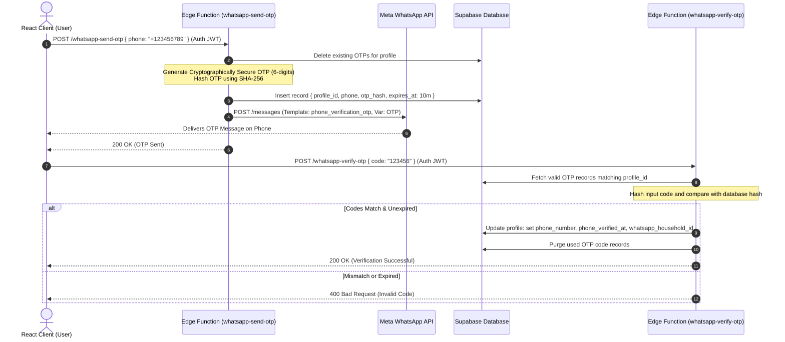

# WhatsApp Integration Solution & Architectural Design Document
**Target Audience:** Solution Architecture Review Board, Lead Software Architects
**Status:** REVISED (v3) — Architecture Review applied + **phased into MVP (deterministic, no AI) and MVP++ (Gemini/agentic)**; pending Developer Feasibility sign-off
**Delivery model:** MVP ships the full channel with a deterministic parser and **zero third-party data egress**; MVP++ swaps the parser seam for AI. See **§1.5**.
**Author:** Principal Integration Architect
**Reviewer:** Solution Architect (v2 corrections)
**Date:** 2026-06-13 (rev. 2026-06-13)

---

## 0. Revision Notes (v2) — Architecture Review Punch-List

> These corrections are **mandatory** before build. Items marked 🔴 were verified
> against the live production schema (`dmxqkvploojokffuhxnz`) and the v9.1 codebase.
> The relevant sections below have been updated to reflect them.

| # | Severity | Finding | Required change | Section |
| :-- | :-- | :-- | :-- | :-- |
| 1 | 🔴 Blocker | `transactions` has **no `profile_id`** column (attribution is `created_by` / `member_id` / `initiated_by`). The RPC insert fails. | Insert `created_by` + `member_id`, not `profile_id`. | §8 |
| 2 | 🔴 Blocker | No `public.transaction_type` / `public.account_kind` **enum types** exist — both columns are `text` + CHECK. The `::enum` casts raise "type does not exist". | Remove the enum casts; pass plain text. | §8 |
| 3 | 🔴 Data integrity | Partner split **mutates `transactions.amount` to half** and never writes the counter-entry → corrupts the ledger and Net Worth. | Use the existing **`SplitInfo`** model (`extras.split`, participants + `yourShare`). **Never mutate `amount`.** | §9 |
| 4 | 🔴 Correctness | Verified-profile query is self-contradictory (`.eq(col,null)` + `.is(col,false)` on a timestamptz). Matches nobody. | `.not("phone_verified_at","is",null)`. | §5 |
| 5 | 🔴 Security | New tables (`whatsapp_verification_otps`, `whatsapp_processed_messages`) have **no RLS** — they hold phone numbers, OTP hashes, financial JSON. Every other Vyact table is RLS-protected. | `ENABLE ROW LEVEL SECURITY` + deny-all-to-client (service-role only). | §3 |
| 6 | 🟠 Correctness | Idempotency is check-then-act (TOCTOU) → Meta retries can double-log. | Claim the `wa_message_id` row **first** via `INSERT … ON CONFLICT DO NOTHING`, branch on rows-affected, then process. | §5 / §8 |
| 7 | 🟠 Correctness | Partner lookup uses membership `role='partner'`, but `'partner'` is the **`household_role`** (role ∈ owner/admin/member/viewer/child). | Query `household_role = 'partner'`. | §9 |
| 8 | 🟠 Security | OTP **verify** has no attempt limiter (10⁶ space, online brute-forceable); signature + OTP compares are non-constant-time. | Max-attempts + lockout on verify; constant-time compares. | §6 / §10 |
| 9 | 🟠 Resilience | Function processes Gemini + RPC + outbound **before** returning 200 → slow Gemini risks Meta timeout + retry storm. | **Ack 200 first**, process via `EdgeRuntime.waitUntil(...)`. | §5 / §11 |
| 10 | 🟡 Privacy | Ships transaction text to **Gemini (free/dev tier)** — reverses Ask Vyact's documented on-device/"no utterance leaves the client" principle, with no DPA/SLA. | **Resolved for MVP** (deterministic parser, no egress — §1.5/§7a). **MVP++ only:** explicit product + privacy sign-off, link-time consent, DPA-covered tier. | §1.5 / §7b |
| 11 | 🟡 Consistency | "Write-only / no financial data" is contradicted by `transaction_logged_success` (echoes amount + account) and `partner_split_prompt` (amount + category). | Strip amounts/account names from confirmations, or soften the claim. | §1 / §2 |
| 12 | 🟡 Hygiene | Inline DDL is not a tracked migration; Graph API pinned to dated `v17.0`; defensive payload parsing missing. | Ship DDL as `supabase/migrations/*.sql`; pin Graph `v21.0`; guard array access. | §3 / §5 / §12 |

**Confirmed-good (kept as-is):** the v9 per-type account matrix (account_id for expense, to_account_id for income, both for transfer/investment) and null-category for transfer/investment; Gemini structured-output constrained to the real v9 category/account IDs; HMAC verification; OTP hashing + expiry. `public.profiles` **does** exist (the §3 reference is valid).

---

## 1. Executive Summary & Scope

This document details the production-grade integration of the Meta WhatsApp Business API with the **Vyact Personal Finance OS**. 

Unlike standard, generic backend webhooks, this implementation is built directly upon the actual Vyact technical stack:
* **Frontend SPA:** Vite + React + TypeScript, hosted on Vercel.
* **Database & Auth:** Supabase (PostgreSQL) + Supabase Auth.
* **Backend Runtime:** Supabase Edge Functions (Deno runtime, ES Modules) to handle incoming webhooks, phone verification (OTP), Gemini processing, and partner notifications.
* **AI Parser:** Google Gemini 2.0 Flash (Free/Developer Tier) using Structured JSON Output configurations.
* **Ledger Engine:** Direct PostgreSQL transaction logic executed via Supabase RPCs and the Supabase Service-Role Admin Client to bypass Row Level Security (RLS) under strict verification rules.

### Key Capabilities in MVP Scope:
1. **Secure Phone Verification (OTP):** Verification of WhatsApp numbers via secure verification codes dispatched through WhatsApp Utility Templates.
2. **Strict Write-Only Channel:** Users can *input* transactions via natural language but *cannot query* sensitive data (e.g., net worth, balances, or transaction history) over WhatsApp, preventing exposure of PII/financial data in a hijacked chat thread.
3. **Uni-Household Context Coupling:** Users tie their verified WhatsApp number to exactly one active Household in their settings.
4. **Partner Split Notifications:** Real-time interactive button messages dispatched to household partners (e.g., co-spouses) to allow instant ledger split categorization.

---

## 1.5 Phased Delivery — MVP (deterministic) vs MVP++ (AI)

The whole integration splits along **one seam: how an inbound message becomes a structured transaction.** Everything else — webhook handshake + signature, OTP verification, household coupling, idempotency, RLS, the `whatsapp_log_transaction` RPC, the SplitInfo partner-button flow, templates, and CI — is **identical in both phases and is built once in the MVP.** Only the parser is swapped.

This deliberately mirrors Vyact's own **Ask Vyact** architecture, where deterministic extraction (normalise → entity-extract) is separated from a swappable model seam ("two seams make a future LLM a drop-in"). We reuse that boundary here.

**Shared seam — both phases implement the same interface; nothing downstream changes:**
```ts
interface MessageParser {
  parse(text: string, ctx: HouseholdContext): ParsedTxResponse | ParseFailure;
}
```

### MVP — system / deterministic (NO AI, NO third-party data egress)
- **Input model:** a small **command grammar** plus the **existing rules-based parser** (`react/src/lib/askVyactParser.ts` — `normalise`, `parseAmount`, `matchCategory`/`KEYWORD_MAP`) ported to the Deno Edge runtime. Pure functions, no network.
  - Accepts e.g. `850 groceries hdfc`, `spent 850 on groceries from hdfc`, `+50000 salary`, `moved 10000 to icici`.
  - On ambiguity / no match → a **deterministic clarifying reply** (`"Couldn't read that — try: <amount> <category> <account>"`). It never guesses.
- **Privacy:** the message is parsed inside Supabase and **never leaves to a third party** — no Gemini, no Google egress. This preserves Ask Vyact's on-device-equivalent posture and **resolves review #10 for the MVP** (no privacy/DPA decision needed to ship).
- Write-only + hard-block-on-query policy (§10) applies.

### MVP++ — AI (Gemini / agentic)
- **Swap the seam** for the Gemini structured-output parser (§7b) to handle messy free text (*"grabbed lunch at the airport, 1200 on amex"*).
- Optional **agentic layer:** multi-turn clarification, fuzzy category/account inference, confidence scoring.
- **Falls back to the MVP parser** on Gemini timeout/failure, so the channel degrades gracefully rather than dropping the message.
- Gated behind the privacy/DPA decisions in §13.3 — those decisions **only** apply to MVP++.

### Capability matrix
| Capability | MVP | MVP++ |
| :-- | :--: | :--: |
| OTP verification, household coupling | ✅ | ✅ (same) |
| Webhook, signature, idempotency, RLS | ✅ | ✅ (same) |
| Ledger RPC insert (v9 constraints) | ✅ | ✅ (same) |
| Partner split via SplitInfo (button replies) | ✅ | ✅ (same) |
| Structured / rules-based parsing | ✅ | superseded by AI |
| Free-text natural-language parsing | — | ✅ |
| Multi-turn clarification / agent | — | ✅ |
| Third-party data egress (Gemini) | ❌ none | ⚠ yes (requires consent + DPA) |

---

## 2. Meta WhatsApp Business API Configuration & Integration Checklist

To authorize Vyact to send and receive messages, the following steps must be completed on the Meta Developer Console and WhatsApp Business Manager.

### Meta Developer Dashboard Setup
1. **Create Meta App:** Create a Business App type in the [Meta App Dashboard](https://developers.facebook.com/).
2. **Add WhatsApp Product:** Add the WhatsApp product to the application.
3. **Obtain API Credentials:**
   * **WhatsApp Business Account ID (WABA ID):** Identified on the WhatsApp Setup page.
   * **Phone Number ID:** The unique identifier for the specific sending number (distinct from the WABA ID).
   * **System User Access Token:** Generate a permanent System User Access Token in Business Manager with `whatsapp_business_messaging` and `whatsapp_business_management` permissions.
4. **Webhook Setup:**
   * Configure Webhook Callback URL pointing to: `https://dmxqkvploojokffuhxnz.supabase.co/functions/v1/whatsapp-webhook`
   * Set the Verification Token to a secure, cryptographically random string stored in Supabase secrets as `WHATSAPP_VERIFY_TOKEN`.
   * Subscribe to Webhook fields: `messages` (triggers on incoming texts, button replies, and delivery status events).

### Message Template Configurations
To initiate conversation flows or send verification codes, WhatsApp requires pre-approved template messages. Five production templates must be submitted and approved:

| Template Name | Category | Language | Template Text | Buttons / Variables |
| :--- | :--- | :--- | :--- | :--- |
| `phone_verification_otp` | UTILITY | English (US) | `Your Vyact verification code is {{1}}. This code expires in 10 minutes.` | None |
| `transaction_logged_success` | UTILITY | English (US) | `Logged: {{1}} {{2}} under "{{3}}" from account "{{4}}".` | [Button: Open Vyact App] |
| `partner_split_prompt` | UTILITY | English (US) | `{{1}} just logged an expense of {{2}} {{3}} under "{{4}}". How should this split?` | [Button: Split 50/50] [Button: Assign to Partner] |
| `transaction_error_feedback` | UTILITY | English (US) | `We couldn't process your message: "{{1}}". Reason: {{2}}. Please try again.` | None |
| `security_alert_unregistered` | UTILITY | English (US) | `A WhatsApp message was received from this number, but it is not linked to a Vyact profile. Link your number in Settings.` | None |

---

## 3. Data Model & Database Migrations

To support WhatsApp integration, we must extend the existing schema to handle verified phone numbers, household links, webhook idempotency, and audit trails.

Below is the DDL migration to execute against the Supabase PostgreSQL database:

```sql
-- Migration: Add WhatsApp Integration Fields
BEGIN;

-- 1. Extend the profiles table to support WhatsApp linkage
ALTER TABLE public.profiles 
ADD COLUMN IF NOT EXISTS phone_number TEXT UNIQUE,
ADD COLUMN IF NOT EXISTS phone_verified_at TIMESTAMP WITH TIME ZONE,
ADD COLUMN IF NOT EXISTS whatsapp_household_id UUID REFERENCES public.households(id) ON DELETE SET NULL;

CREATE INDEX IF NOT EXISTS idx_profiles_phone_number ON public.profiles(phone_number) WHERE phone_number IS NOT NULL;
CREATE INDEX IF NOT EXISTS idx_profiles_whatsapp_household ON public.profiles(whatsapp_household_id) WHERE whatsapp_household_id IS NOT NULL;

-- 2. Create verification codes table for OTP flow
CREATE TABLE IF NOT EXISTS public.whatsapp_verification_otps (
    id UUID PRIMARY KEY DEFAULT gen_random_uuid(),
    profile_id UUID NOT NULL REFERENCES public.profiles(id) ON DELETE CASCADE,
    phone_number TEXT NOT NULL,
    otp_hash TEXT NOT NULL,
    expires_at TIMESTAMP WITH TIME ZONE NOT NULL,
    created_at TIMESTAMP WITH TIME ZONE DEFAULT timezone('utc'::text, now()) NOT NULL
);

CREATE INDEX IF NOT EXISTS idx_whatsapp_otps_phone_lookup 
ON public.whatsapp_verification_otps(phone_number, expires_at);

-- 3. Create Webhook Idempotency & Audit Log table to prevent double-logging
CREATE TABLE IF NOT EXISTS public.whatsapp_processed_messages (
    wa_message_id TEXT PRIMARY KEY,
    profile_id UUID NOT NULL REFERENCES public.profiles(id) ON DELETE CASCADE,
    household_id UUID NOT NULL REFERENCES public.households(id) ON DELETE CASCADE,
    incoming_text TEXT,
    parsed_json JSONB,
    created_at TIMESTAMP WITH TIME ZONE DEFAULT timezone('utc'::text, now()) NOT NULL
);

-- Index to query webhook history and prevent double execution
CREATE INDEX IF NOT EXISTS idx_whatsapp_processed_messages_created_at 
ON public.whatsapp_processed_messages(created_at DESC);

-- 4. RLS — v2 FIX (#5). These tables hold phone numbers, OTP hashes, and parsed
-- financial JSON. Every Vyact table is RLS-protected; without this the anon /
-- authenticated key could read them. Service-role bypasses RLS, so the Edge
-- Functions (which use SUPABASE_SERVICE_ROLE_KEY) are unaffected; we simply add
-- NO client policies, which denies all anon/authenticated access by default.
ALTER TABLE public.whatsapp_verification_otps  ENABLE ROW LEVEL SECURITY;
ALTER TABLE public.whatsapp_processed_messages ENABLE ROW LEVEL SECURITY;
-- (Intentionally no GRANT/policy for anon/authenticated → deny-all to clients.)

COMMIT;
```

> **Migration discipline (v2 FIX #12):** this DDL must ship as a tracked file —
> `supabase/migrations/<timestamp>_whatsapp_integration.sql` — so it is applied by
> the CI `db push` step, not pasted ad-hoc. Follow the same forward-only,
> idempotent conventions as the v9 migrations.

---

## 4. System Architecture Topology & Data Flow

```
┌─────────────────┐             ┌─────────────────────┐             ┌─────────────────────────┐
│  WhatsApp App   ├────────────►│ Meta WhatsApp Cloud ├────────────►│ Supabase Edge Function  │
│  (User Device)  │◄────────────┤      Gateway        │             │   (whatsapp-webhook)    │
└─────────────────┘             └─────────────────────┘             └────────────┬────────────┘
                                                                                 │
                                                                                 ▼ (Decrypt & Validate Signature)
                                                                    ┌─────────────────────────┐
                                                                    │ Resolve Profile & Household│
                                                                    └────────────┬────────────┘
                                                                                 │
                                   ┌─────────────────────────────────────────────┴─────────────────────────────────────────────┐
                                   ▼ [If User Input Text]                                                                      ▼ [If Interactive Button Reply]
                     ┌──────────────────────────────┐                                                            ┌──────────────────────────────┐
                     │ Call Gemini 2.0 Flash Parser │                                                            │ Parse Button Response        │
                     │  (Structured JSON Output)    │                                                            │ (`split_50_50:${txnId}`)     │
                     └─────────────┬────────────────┘                                                            └──────────────┬───────────────┘
                                   │                                                                                            │
                                   ▼                                                                                            ▼
                     ┌──────────────────────────────┐                                                            ┌──────────────────────────────┐
                     │ Execute Atomic Postgres RPC  │                                                            │ Mutate Existing Transaction │
                     │   (Ledger Insert & Update)   │                                                            │   (Adjust Split Proportions) │
                     └─────────────┬────────────────┘                                                            └──────────────┬───────────────┘
                                   │                                                                                            │
                                   ├─────────────────────────────────────────────┬──────────────────────────────────────────────┘
                                   │                                             │
                                   ▼ [If Success & Split Needed]                 ▼ [If Success & Direct Log]
                     ┌──────────────────────────────┐                             ┌──────────────────────────────┐
                     │ Dispatch Interactive Split   │                             │ Dispatch Outbound Template   │
                     │ Template to Household Partner│                             │ Confirming Transaction Logged│
                     └──────────────────────────────┘                             └──────────────────────────────┘
```

---

## 5. Phase 1: Inbound Webhook Gateway (`whatsapp-webhook`)

This Supabase Edge Function acts as the entry point. It handles Meta's verification handshake (GET) and processes inbound messages (POST). It validates incoming payloads cryptographically using the `X-Hub-Signature-256` header.

Save this in Supabase as: `supabase/functions/whatsapp-webhook/index.ts`

```typescript
import { serve } from "https://deno.land/std@0.168.0/http/server.ts";
import { createClient } from "https://esm.sh/@supabase/supabase-js@2.21.0";

const verifyToken = Deno.env.get("WHATSAPP_VERIFY_TOKEN") || "";
const appSecret = Deno.env.get("WHATSAPP_APP_SECRET") || "";
const supabaseUrl = Deno.env.get("SUPABASE_URL") || "";
const supabaseServiceKey = Deno.env.get("SUPABASE_SERVICE_ROLE_KEY") || "";

// Cryptographic signature validator
async function verifySignature(body: string, signature: string): Promise<boolean> {
  if (!signature.startsWith("sha256=")) return false;
  const signatureHash = signature.slice(7);

  const encoder = new TextEncoder();
  const keyBuf = encoder.encode(appSecret);
  const dataBuf = encoder.encode(body);

  const cryptoKey = await crypto.subtle.importKey(
    "raw",
    keyBuf,
    { name: "HMAC", hash: "SHA-256" },
    false,
    ["sign"]
  );

  const signatureBuffer = await crypto.subtle.sign("HMAC", cryptoKey, dataBuf);
  const hashArray = Array.from(new Uint8Array(signatureBuffer));
  const expectedHash = hashArray.map(b => b.toString(16).padStart(2, "0")).join("");

  return signatureHash === expectedHash;
}

serve(async (req: Request) => {
  const url = new URL(req.url);

  // 1. Webhook Handshake Verification
  if (req.method === "GET") {
    const mode = url.searchParams.get("hub.mode");
    const token = url.searchParams.get("hub.verify_token");
    const challenge = url.searchParams.get("hub.challenge");

    if (mode === "subscribe" && token === verifyToken) {
      return new Response(challenge, { status: 200 });
    }
    return new Response("Forbidden", { status: 403 });
  }

  // 2. Incoming Event Processing
  if (req.method === "POST") {
    const signature = req.headers.get("x-hub-signature-256") || "";
    const rawBody = await req.text();

    if (!await verifySignature(rawBody, signature)) {
      return new Response("Unauthorized Signature", { status: 401 });
    }

    const payload = JSON.parse(rawBody);
    
    // Ignore status updates
    const message = payload.entry?.[0]?.changes?.[0]?.value?.messages?.[0];
    if (!message) {
      return new Response(JSON.stringify({ status: "ignored_event" }), {
        status: 200,
        headers: { "Content-Type": "application/json" }
      });
    }

    const waMessageId = message.id;
    const phone = payload.entry[0].changes[0].value.contacts[0].wa_id;
    const textBody = message.text?.body || null;
    const interactiveReply = message.interactive?.button_reply || null;

    // Initialize Supabase Client with service_role bypass for secure background processing
    const supabase = createClient(supabaseUrl, supabaseServiceKey);

    // Resolve Profile by phone number. v2 FIX (#4): assert verified via
    // `phone_verified_at IS NOT NULL` — the prior `.eq(col,null)` + `.is(col,false)`
    // was self-contradictory (timestamptz, not boolean) and matched nobody.
    const { data: profile, error: pError } = await supabase
      .from("profiles")
      .select("id, whatsapp_household_id")
      .eq("phone_number", phone)
      .not("phone_verified_at", "is", null)   // verified only
      .maybeSingle();

    // If profile is not found or has no linked household, reject
    if (pError || !profile || !profile.whatsapp_household_id) {
      // Send security warning message back to unregistered phone
      await sendTemplateMessage(phone, "security_alert_unregistered", []);
      return new Response(JSON.stringify({ status: "unregistered_sender" }), { status: 200 });
    }

    // Check Idempotency
    const { data: existingMsg } = await supabase
      .from("whatsapp_processed_messages")
      .select("wa_message_id")
      .eq("wa_message_id", waMessageId)
      .maybeSingle();

    if (existingMsg) {
      return new Response(JSON.stringify({ status: "duplicate" }), { status: 200 });
    }

    // Process Message
    try {
      if (textBody) {
        await handleInboundText(supabase, profile.id, profile.whatsapp_household_id, waMessageId, phone, textBody);
      } else if (interactiveReply) {
        await handleInteractiveReply(supabase, profile.id, profile.whatsapp_household_id, waMessageId, phone, interactiveReply.id);
      }
    } catch (err) {
      console.error("Workflow error:", err);
      await sendTemplateMessage(phone, "transaction_error_feedback", [textBody || "", err.message]);
    }

    return new Response(JSON.stringify({ status: "processed" }), {
      status: 200,
      headers: { "Content-Type": "application/json" }
    });
  }

  return new Response("Method Not Allowed", { status: 405 });
});

// Outbound API Caller Utility
async function sendTemplateMessage(to: string, templateName: string, parameters: string[]) {
  const phoneId = Deno.env.get("WHATSAPP_PHONE_NUMBER_ID");
  const token = Deno.env.get("WHATSAPP_ACCESS_TOKEN");
  const url = `https://graph.facebook.com/v21.0/${phoneId}/messages`;  // v2 FIX #12: pin a current Graph API version

  const components = parameters.length > 0 ? [{
    type: "body",
    parameters: parameters.map(p => ({ type: "text", text: p }))
  }] : [];

  const res = await fetch(url, {
    method: "POST",
    headers: {
      "Authorization": `Bearer ${token}`,
      "Content-Type": "application/json"
    },
    body: JSON.stringify({
      messaging_product: "whatsapp",
      recipient_type: "individual",
      to,
      type: "template",
      template: {
        name: templateName,
        language: { code: "en_US" },
        components
      }
    })
  });

  if (!res.ok) {
    const errText = await res.text();
    throw new Error(`Meta API dispatch failure: ${errText}`);
  }
}
```

---

## 6. Phase 2: Phone Verification (OTP) Flow

To securely link their WhatsApp account, the user must enter their phone number on the Vyact settings page and complete an OTP handshake.

### Verification Sequence Diagram



---

## 7a. Phase 3a (MVP): Deterministic Parser — NO AI

The MVP parses messages **without any model**, reusing Vyact's existing rules-based
extractor. Both this and the MVP++ Gemini parser implement the same `MessageParser`
seam (§1.5), so the downstream RPC, idempotency, and outbound flows are unchanged.

**Strategy (in priority order):**
1. **Command grammar (most reliable):** `<amount> <category> [<account>]`, an optional
   verb prefix, and `+` for income. Examples → result:
   * `850 groceries hdfc` → expense 850, `groceries`, account "hdfc"
   * `spent 850 on groceries from hdfc` → same (filler words ignored)
   * `+50000 salary` → income 50000, `salary`
   * `moved 10000 to icici` → transfer (needs source+dest; prompt if missing)
2. **Rules-based NL fallback:** port `react/src/lib/askVyactParser.ts` (`normalise`,
   `parseAmount` with k/lakh/cr shorthands, `matchCategory` over `KEYWORD_MAP`) to the
   Edge runtime — pure, deterministic, offline.
3. **No confident parse → clarify, never guess:** reply with the command format and an
   example. (Mirrors the MVP "honest, deterministic" contract.)

```typescript
// Deterministic MVP parser — same return shape as the AI parser (§7b).
// Reuse the pure functions from lib/askVyactParser.ts (ported to Deno).
function parseMessageDeterministic(
  text: string,
  accounts: { name: string; type: string }[],
): ParsedTxResponse | { error: string } {
  const norm = normalise(text);                       // lib/askVyactParser
  const amount = parseAmount(norm);                   // 10k → 10000, 3 lakh → 300000
  if (amount == null) return { error: "no_amount" };  // → clarifying reply

  const isIncome = /^\+|\b(salary|received|got paid|credited)\b/.test(norm);
  const category = matchCategory(norm) ?? null;       // KEYWORD_MAP longest-match
  const account = matchAccountAlias(norm, accounts);  // exact/substring on names+kinds

  return {
    amount,
    currency: detectCurrency(norm) ?? "USD",          // ₹/€/explicit code, else base
    transaction_type: isIncome ? "income" : "expense",// transfer/investment via keywords
    category_id: isIncome
      ? (category && INCOME_IDS.has(category) ? category : "other_income")
      : (category && EXPENSE_IDS.has(category) ? category : "other_expense"),
    account_alias: account ?? "cash",                 // §10: unresolved → cash default
    to_account_alias: null,
  };
}
```

> **Scope honesty:** the deterministic parser will mis-handle genuinely messy free
> text ("dinner with the team came to about 1.2k, put it on the amex"). That is the
> accepted MVP trade-off — clarity + zero data egress over coverage. MVP++ (§7b)
> closes the coverage gap.

---

## 7b. Phase 3b (MVP++): Gemini 2.0 Flash AI Parser

When an incoming message contains natural text describing a transaction (e.g., *"Spent 850 at Trader Joe's using Bank Account"*), the message body is parsed using **Gemini 2.0 Flash**. This **replaces** the deterministic seam from §7a in MVP++ and falls back to it on failure.

We enforce a strict JSON output matching Vyact's ledger schemas, accounts, and category IDs.

### Supported Category IDs (from actual codebase constants)
* **Expense:** `food_dining`, `groceries`, `transport`, `rent_mortgage`, `utilities`, `shopping`, `health`, `entertainment`, `education`, `travel`, `childcare`, `insurance`, `loan_emi`, `other_expense`
* **Income:** `salary`, `freelance`, `gift_bonus`, `rental_income`, `business_revenue`, `other_income`

### Supported Account Types:
* `cash`, `bank`, `credit_card`, `investment`, `loan`

### Parser Edge Implementation Wrapper

```typescript
// Part of whatsapp-webhook parser pipeline
interface ParsedTxResponse {
  amount: number;
  currency: string;
  transaction_type: 'expense' | 'income' | 'investment' | 'transfer';
  category_id: string | null;
  account_alias: string;
  to_account_alias: string | null;
}

async function runGeminiParser(textBody: string, householdAccounts: { name: string, type: string }[]): Promise<ParsedTxResponse> {
  const geminiApiKey = Deno.env.get("GEMINI_API_KEY") || "";
  const endpoint = `https://generativelanguage.googleapis.com/v1beta/models/gemini-2.0-flash:generateContent?key=${geminiApiKey}`;

  const accountInstructions = householdAccounts.map(a => `- "${a.name}" (Type: ${a.type})`).join("\n");

  const systemPrompt = `
You are the ledger parser engine for Vyact Personal Finance OS.
Extract financial attributes from unstructured user messages.

Available Accounts in this Household:
${accountInstructions}

Rules:
1. "transaction_type" must be exactly: "expense", "income", "investment", or "transfer".
2. "category_id" must map to one of:
   - For "expense": "food_dining", "groceries", "transport", "rent_mortgage", "utilities", "shopping", "health", "entertainment", "education", "travel", "childcare", "insurance", "loan_emi", "other_expense".
   - For "income": "salary", "freelance", "gift_bonus", "rental_income", "business_revenue", "other_income".
   - For "investment" and "transfer", category_id MUST be null.
3. If no matching account is explicitly named in the input text, set "account_alias" to "cash".
4. For transfers/investments, resolve "to_account_alias". Otherwise, leave it null.
5. Base currency is USD. If a different symbol is identified (e.g., ₹/INR or €/EUR), capture the currency code.
`;

  const requestBody = {
    contents: [{ parts: [{ text: `Parse this message: "${textBody}"` }] }],
    systemInstruction: { parts: [{ text: systemPrompt }] },
    generationConfig: {
      temperature: 0.0,
      responseMimeType: "application/json",
      responseSchema: {
        type: "OBJECT",
        properties: {
          amount: { type: "NUMBER" },
          currency: { type: "STRING" },
          transaction_type: { type: "STRING", enum: ["expense", "income", "investment", "transfer"] },
          category_id: { type: "STRING", nullable: true },
          account_alias: { type: "STRING" },
          to_account_alias: { type: "STRING", nullable: true }
        },
        required: ["amount", "currency", "transaction_type", "category_id", "account_alias"]
      }
    }
  };

  const response = await fetch(endpoint, {
    method: "POST",
    headers: { "Content-Type": "application/json" },
    body: JSON.stringify(requestBody)
  });

  if (!response.ok) {
    const errorDetails = await response.text();
    throw new Error(`Gemini Parsing Failure: ${errorDetails}`);
  }

  const result = await response.json();
  const parsedText = result.candidates[0].content.parts[0].text;
  return JSON.parse(parsedText) as ParsedTxResponse;
}
```

---

## 8. Phase 4: Atomic Ledger Mutation & Verification

Once parsed, the transaction must be committed to the database. Since Vyact computes account balances dynamically based on the ledger log, we must ensure all constraints added in **v9 schema migration** are satisfied:

* **Category Constraint:** Category is required for `expense`/`income`, and must be `NULL` for `investment`/`transfer`.
* **Account Constraint:** `expense` requires only `account_id` (representing source wallet); `income` requires only `to_account_id` (representing destination wallet); `transfer`/`investment` require both.

To run these mutations atomically, we execute a database transaction using a Supabase PostgreSQL function via RPC.

### Database Transaction Function (`whatsapp_log_transaction`)

```sql
CREATE OR REPLACE FUNCTION public.whatsapp_log_transaction(
    p_profile_id UUID,
    p_household_id UUID,
    p_amount NUMERIC,
    p_currency TEXT,
    p_txn_type TEXT,
    p_category_id TEXT,
    p_account_alias TEXT,
    p_to_account_alias TEXT,
    p_wa_message_id TEXT,
    p_incoming_text TEXT
) RETURNS JSONB SECURITY DEFINER AS $$
DECLARE
    v_account_id UUID;
    v_to_account_id UUID;
    v_txn_id UUID;
    v_ret_json JSONB;
BEGIN
    -- 1. Validate Idempotency
    IF EXISTS (SELECT 1 FROM public.whatsapp_processed_messages WHERE wa_message_id = p_wa_message_id) THEN
        RETURN jsonb_build_object('status', 'duplicate', 'message', 'Message ID already processed');
    END IF;

    -- 2. Resolve Primary Account (Source)
    IF p_account_alias IS NOT NULL AND p_account_alias <> '' THEN
        SELECT id INTO v_account_id FROM public.accounts 
        WHERE household_id = p_household_id 
          AND (LOWER(name) = LOWER(p_account_alias) OR LOWER(kind::text) = LOWER(p_account_alias))
        LIMIT 1;
    END IF;

    -- Fallback to Cash account if not resolved.
    -- v2 FIX (#2): `kind` is TEXT (CHECK CK_account_kind), NOT an enum — no
    -- `::public.account_kind` cast exists. Compare as text.
    IF v_account_id IS NULL AND p_txn_type IN ('expense', 'transfer', 'investment') THEN
        SELECT id INTO v_account_id FROM public.accounts 
        WHERE household_id = p_household_id AND kind = 'cash'
        LIMIT 1;
        
        IF v_account_id IS NULL THEN
            RAISE EXCEPTION 'Target primary account and cash fallback cannot be resolved.';
        END IF;
    END IF;

    -- 3. Resolve Destination Account (Required for transfers/investments)
    IF p_to_account_alias IS NOT NULL AND p_to_account_alias <> '' THEN
        SELECT id INTO v_to_account_id FROM public.accounts 
        WHERE household_id = p_household_id 
          AND (LOWER(name) = LOWER(p_to_account_alias) OR LOWER(kind::text) = LOWER(p_to_account_alias))
        LIMIT 1;
    END IF;

    -- Fallback for income destination
    IF v_to_account_id IS NULL AND p_txn_type = 'income' THEN
        SELECT id INTO v_to_account_id FROM public.accounts 
        WHERE household_id = p_household_id 
          AND (LOWER(name) = LOWER(p_account_alias) OR LOWER(kind::text) = LOWER(p_account_alias))
        LIMIT 1;
    END IF;

    -- 4. Execute Insertion honoring v9 structural restrictions.
    -- v2 FIX (#1): `transactions` has NO `profile_id` column. Attribution is
    --   `created_by` (auth user) + `member_id` (household member). We resolve the
    --   member from the profile's membership in this household.
    -- v2 FIX (#2): `type` is TEXT (CHECK CK_txn_type), NOT an enum — drop the
    --   `::public.transaction_type` cast.
    INSERT INTO public.transactions (
        household_id,
        created_by,
        member_id,
        amount,
        currency,
        type,
        category,
        account_id,
        to_account_id,
        date,
        description
    ) VALUES (
        p_household_id,
        p_profile_id,   -- created_by: the auth.uid() backing this profile
        (SELECT id FROM public.memberships
           WHERE household_id = p_household_id AND user_id = p_profile_id LIMIT 1),
        p_amount,
        p_currency,
        p_txn_type,
        CASE WHEN p_txn_type IN ('expense', 'income') THEN p_category_id ELSE NULL END,
        CASE WHEN p_txn_type IN ('expense', 'transfer', 'investment') THEN v_account_id ELSE NULL END,
        CASE WHEN p_txn_type IN ('income', 'transfer', 'investment') THEN v_to_account_id ELSE NULL END,
        CURRENT_DATE,
        COALESCE(p_incoming_text, 'Logged via WhatsApp')
    ) RETURNING id INTO v_txn_id;

    -- 5. Track Message Idempotency log
    INSERT INTO public.whatsapp_processed_messages (
        wa_message_id,
        profile_id,
        household_id,
        incoming_text,
        parsed_json
    ) VALUES (
        p_wa_message_id,
        p_profile_id,
        p_household_id,
        p_incoming_text,
        jsonb_build_object(
            'amount', p_amount,
            'currency', p_currency,
            'transaction_type', p_txn_type,
            'category_id', p_category_id,
            'account_id', v_account_id,
            'to_account_id', v_to_account_id
        )
    );

    SELECT jsonb_build_object(
        'status', 'success',
        'transaction_id', v_txn_id,
        'amount', p_amount,
        'currency', p_currency,
        'category_id', p_category_id,
        'account_name', (SELECT name FROM public.accounts WHERE id = v_account_id),
        'to_account_name', (SELECT name FROM public.accounts WHERE id = v_to_account_id)
    ) INTO v_ret_json;

    RETURN v_ret_json;
END;
$$ LANGUAGE plpgsql SECURITY DEFINER;
```

---

## 9. Phase 5: Outbound Split Engine & Partner Routing Loop

If a logged transaction is an expense and a partner is active in the user's current household, the system initiates the partner split loop.

### Partner Identification Logic
1. Look up memberships in the current `household_id` where **`household_role = 'partner'`**.
   *(v2 FIX #7: `'partner'` is the `household_role` enum value — `primary|partner|child|elder`. The `role` column is the app-role `owner|admin|member|viewer|child` and will never equal `'partner'`.)*
2. Verify if the partner has a verified WhatsApp number linked (`phone_verified_at IS NOT NULL` and `whatsapp_household_id = household_id`).
3. If both match, trigger a WhatsApp **Interactive Button Message** to the partner.

### Interactive Button Reply Verification Callback
When the partner selects a response, Meta dispatches a button reply webhook containing an ID (e.g., `split_50_50:${transactionId}` or `assign_sole:${transactionId}`). The webhook processes the reply and modifies the database record.

```typescript
async function handleInteractiveReply(
  supabase: any,
  profileId: string,
  householdId: string,
  waMessageId: string,
  partnerPhone: string,
  replyId: string
) {
  // Parse reply ID pattern: action:transaction_id
  const parts = replyId.split(":");
  const action = parts[0];
  const transactionId = parts[1];

  if (action === "split_50_50") {
    // v2 FIX (#3): DO NOT mutate `transactions.amount` — that destroys the
    // ledger truth (the expense really was the full amount) and breaks Net Worth.
    // Vyact already models people-splitting via SplitInfo on `extras.split`
    // (see types.ts: { isSplit, totalAmount, yourShare, paidBy, participants[] }).
    // A 50/50 split keeps the full amount and records that half is owed back.
    const { data: txn } = await supabase
      .from("transactions")
      .select("amount, currency, extras")
      .eq("id", transactionId)
      .single();

    if (txn) {
      const total = parseFloat(txn.amount);
      const half = Math.round((total / 2) * 100) / 100;
      const splitInfo = {
        isSplit: true,
        totalAmount: total,
        yourShare: half,                 // logger keeps their half
        paidBy: "me",                    // the logger paid the bill
        participants: [
          { name: "You", isYou: true, share: half, paid: true },
          { name: "Partner",            share: total - half, paid: false },
        ],
      };
      // Merge into extras WITHOUT touching `amount` (full amount stays true).
      await supabase
        .from("transactions")
        .update({ extras: { ...(txn.extras ?? {}), split: splitInfo } })
        .eq("id", transactionId);
    }
  }
  // NOTE (developer): the `assign_sole` action and the reciprocal "who-owes-whom"
  // settlement are out of MVP scope here — reuse the in-app Splits settlement
  // path rather than inventing parallel accounting over WhatsApp.

  // Record idempotency logging to prevent processing the action multiple times
  await supabase
    .from("whatsapp_processed_messages")
    .insert({
      wa_message_id: waMessageId,
      profile_id: profileId,
      household_id: householdId,
      incoming_text: `Button click: ${action}`,
      parsed_json: { action, transactionId }
    });
}
```

---

## 10. Security Boundaries & Exception Handling Matrix

To protect user accounts over an unauthenticated integration channel, we apply a zero-trust policy.

| Failure State | Technical Cause | Mitigation Logic & Reply Payload |
| :--- | :--- | :--- |
| **Parsing Mismatch** | Gemini returns a parsing confidence exception or invalid parameters. | Dispatches `transaction_error_feedback` template. Prompt: *"We couldn't parse that transaction details. Try: 'Spent 15 for lunch from credit card'."* |
| **Unknown Account** | The parsed bank account alias doesn't match household accounts. | Falls back to **`cash`** account as a safe default, appending `[Account Unresolved: Defaulted to Cash]` to the description. |
| **Read/Query Attempt** | User attempts to ask for statements, net worth, or balances (e.g., *"How much do I have left?"*). | **Hard Block Policy:** Disallow data output queries. Return link to app: `https://vyact-twentyx.vercel.app/dashboard` to require secure device login. |
| **DB Mutation Timeout** | DB concurrency locks or connection timeouts ($>3000\text{ms}$). | Abort database execution loop. Queue payload to a temporary retry table in Supabase. Notify user: *"We've queued your transaction update and are processing it now."* |
| **Spoofed Webhook Signature** | Signature validation fails during webhook delivery. | Drop request immediately with `401 Unauthorized` status. Log the attempt to secure logs for security auditing. |

---

## 11. Scalability & Operational Concerns

To ensure reliability at scale, the integration addresses the following operational concerns:

1. **Webhook Timeout Limits:** Meta expects a `200 OK` within 10 seconds. **v2 FIX (#9):** do **not** rely on the full loop finishing in ~1.5s — Gemini p95 can exceed that and a slow call triggers Meta retries (which, with the strengthened idempotency in #6, are now safe but wasteful). **Acknowledge `200` immediately after signature validation + the idempotency claim, then run parse → RPC → outbound via `EdgeRuntime.waitUntil(...)`** so a slow model never causes a timeout/retry storm.
   - **OTP verify limiter (#8):** add a per-profile attempt counter + lockout (e.g. 5 attempts / 15 min) on `whatsapp-verify-otp`; a 6-digit code is online-brute-forceable without it. Use a constant-time compare for the OTP hash and the webhook signature.
2. **Cold Starts:** Supabase Edge Functions maintain low latency, but high-traffic periods benefit from warm function environments. 
3. **Database Locks:** The `whatsapp_log_transaction` RPC isolates ledger inserts to minimize row locks. Because account balances are calculated dynamically rather than updating a single summary row, transaction inserts do not block write operations on other tables.
4. **Rate Limiting:** Webhook processing relies on Meta's internal API rate limiters. We limit outgoing verification dispatches to 1 code per 60 seconds per phone number to prevent spam attacks.

---

## 12. Integration Effort Estimate & CI/CD Deployment

The deployment pipeline is updated to handle Supabase Edge Functions automatically alongside existing deployments.

### GitHub Actions Workflow Integration (`.github/workflows/deploy.yml`)
Add a deployment step to upload the Edge Functions to the production Supabase instance:

```yaml
  deploy-edge-functions:
    runs-on: ubuntu-latest
    needs: db-migrations
    steps:
      - name: Checkout Code
        uses: actions/checkout@v3

      - name: Setup Supabase CLI
        uses: supabase/setup-cli@v1
        with:
          version: 'latest'

      - name: Deploy Edge Functions
        run: |
          supabase link --project-ref dmxqkvploojokffuhxnz -p ${{ secrets.SUPABASE_DB_PASSWORD }}
          supabase functions deploy whatsapp-webhook --no-verify-jwt
          supabase functions deploy whatsapp-send-otp
          supabase functions deploy whatsapp-verify-otp
        env:
          SUPABASE_ACCESS_TOKEN: ${{ secrets.SUPABASE_ACCESS_TOKEN }}
```

### Development vs Production Environments
* **Development:** Use local Deno testing environments, `supabase start`, and tunneling services like `ngrok` or `localtunnel` to route local hooks to `http://localhost:54321/functions/v1/whatsapp-webhook` for sandbox verification.
* **Production:** Deployed functions run on Supabase's distributed network, communicating directly with the production database instance (`dmxqkvploojokffuhxnz`).

> ⚠ **CI dependency check (v2 FIX #12):** the `deploy-edge-functions` job declares
> `needs: db-migrations`. The current `.github/workflows/deploy.yml` does **not**
> contain a `db-migrations` job — confirm/author it (or change the `needs:` target)
> before merging, or the workflow will fail to schedule.

---

## 13. Developer Handover — Feasibility & Timeline Review

**To:** Implementing Developer  **From:** Solution Architect  **Action:** Review and return with confirmed feasibility + estimates before we book the sprint.

This is **not** a build authorization yet. The architecture is sound and the v2 fixes above make it buildable, but two items need a **product/privacy decision** (not just engineering) and a few need a **spike** before we can commit dates. Please review each work item, confirm or challenge my feasibility call and day-estimate, and flag anything I've under-scoped.

### 13.1 What you are reviewing
- The **v2 corrected** design (this document). Start at **§0** — every mandated change is listed there with its section.
- Validate the corrected SQL/TypeScript against the live schema yourself (don't trust the doc): `transactions` columns, `memberships(household_role, user_id)`, `profiles(id, …)`, and the v9 CHECK constraints (`CK_txn_type`, `CK_txn_category_by_type`, `CK_txn_accounts_by_type`, `CK_account_kind`).

### 13.2 Work breakdown — split by phase; confirm feasibility & effort for EACH
> Phase: **MVP** (deterministic, no AI) · **MVP++** (AI increment) · **Shared** (built in MVP, unchanged by MVP++).
> Feasibility: **✅ Feasible** · **🔬 Spike first** · **🚫 Not feasible as written**.
> The two effort columns are **architect rough order-of-magnitude (1 dev)** — the developer must **replace both with their own MVP and MVP++ estimates.** Leave a cell blank if the item doesn't apply to that phase.

| # | Work item | Phase | Feasibility | MVP est. (d) | MVP++ est. (d) | Dev confirm (✅/✏️) | Notes |
| :-- | :-- | :-- | :-- | :--: | :--: | :-- | :-- |
| W1 | DB migration (tracked): profiles cols, OTP + idempotency tables, **RLS enabled** | Shared | ✅ | 0.5 | — | | §3 |
| W2 | `whatsapp-webhook` Edge Fn: handshake, constant-time signature, **idempotency claim-first**, **ack-200 + waitUntil** | Shared | ✅ | 2.0 | — | | §5; write `handleInboundText` |
| W3 | OTP send + verify Edge Fns incl. **attempt limiter/lockout** | Shared | ✅ | 1.5 | — | | §6 |
| W4 | React Settings UI: phone + OTP + household coupling | Shared | ✅ | 1.5 | — | | reuses Settings patterns |
| W5 | `whatsapp_log_transaction` RPC (`created_by`/`member_id`, no enum casts, v9 CHECK-safe) | Shared | ✅ | 1.5 | — | | §8 |
| W6 | Partner split via **SplitInfo** + button-reply handler | Shared | 🔬 | 2.0 | — | | §9; deterministic (button events, no AI) |
| W7 | Outbound confirmation + **5 Meta templates** (submit + approval) | Shared | 🔬 | 1.0 +approval | — | | §2; approval is external lead time |
| W8 | CI: `db-migrations` + `deploy-edge-functions` jobs; secrets | Shared | ✅ | 1.0 | — | | §12 |
| **W9** | **Deterministic parser**: command grammar + port `askVyactParser` to Edge + clarify-on-fail | **MVP** | ✅ | 2.5 | — | | §7a; **no data egress** |
| W10 | Test pass (MVP): signature, idempotency race, RPC constraints, OTP lockout, parser cases | MVP | ✅ | 1.5 | — | | extend vitest/CON-* |
| **W11** | **Gemini parser** (structured output, v9 IDs) **behind the same seam** + **fallback to W9** | **MVP++** | 🔬 | — | 1.5 +spike | | §7b; spike free-tier latency/limits |
| W12 | Privacy plumbing: link-time consent, parser-mode flag, Gemini key/secret, redaction | MVP++ | ✅ | — | 1.0 | | gated by §13.3 decisions |
| W13 | (Optional) agentic layer: multi-turn clarify, fuzzy account/category, confidence | MVP++ | 🔬 | — | 3.0+ spike | | stretch; estimate separately |
| W14 | Test pass (MVP++): parser parity vs W9, fallback path, consent gating | MVP++ | ✅ | — | 1.0 | | |

**Architect rough totals (1 dev): MVP ≈ 15 dev-days** (+ Meta template approval lead time, parallel) · **MVP++ ≈ 4–7 dev-days** on top (W13 optional). **Developer: confirm or replace both.**

### 13.3 Decisions required BEFORE build
**MVP can ship with NONE of the AI decisions** — it has no third-party egress. These gate **MVP++ only**:
1. **🚫/decision — Privacy (review #10, MVP++):** Gemini sends transaction text to Google, reversing Ask Vyact's on-device stance. Needs **product + privacy sign-off**, link-time consent, privacy-policy update, and a tier with a DPA for production. *(MVP is unaffected — it never calls Gemini.)*
2. **decision — Gemini tier (MVP++):** free/dev tier has no SLA/DPA and rate limits — confirm the production tier before W11 spike sign-off.

Apply to **both phases** (deterministic items, decide before MVP):
3. **decision — "Write-only" exposure (review #11):** may outbound confirmations include amount + account name? Default: **strip them**.
4. **decision — Meta templates:** who owns WhatsApp Business verification + template submission, and when does the approval clock start? Gates W7 end-to-end.
5. **scope — Partner split MVP:** confirm `assign_sole` + reciprocal settlement are deferred (W6 covers `split_50_50` only).

### 13.4 Dependencies (outline; developer to confirm + add any missed)
**MVP++ depends on MVP** — the entire shared spine (W1–W8) plus the W9 parser **and its `MessageParser` seam** must exist first; W11 only swaps the seam implementation and adds the fallback, so MVP++ is a true increment, not a re-architecture.

| Dependency | Type | Blocks | Owner | Notes |
| :-- | :-- | :-- | :-- | :-- |
| Meta WhatsApp Business verification + System User token | External (Meta) | All inbound/outbound | Product/Ops | Account verification can take days |
| 5 message templates approved | External (Meta) | W7, partner split | Product | Days–weeks; start at kickoff, parallel |
| `db-migrations` CI job exists | Internal | W8 deploy | Dev | §12 — confirm or author |
| `MessageParser` seam (W9) | Internal | **W11 (MVP++)** | Dev | The hard prerequisite for the AI swap |
| Privacy/DPA + consent sign-off | Decision | **W11/W12 (MVP++)** | Product/Legal | Does **not** block MVP |
| Gemini API key + chosen tier | External (Google) | **W11 (MVP++)** | Dev/Ops | Free tier for spike only |
| v9 CHECK constraints + live schema | Internal (exists) | W5 RPC | Dev | Validate, don't trust the doc |

### 13.5 Developer deliverable back to architecture
Return: (a) **§13.2 with separate MVP and MVP++ effort** confirmed or amended; (b) any **🚫 not-feasible** items + blocking reason; (c) spike findings for W6/W7/W11/W13; (d) a critical-path timeline showing the **MVP milestone** (shippable without any AI decision) and the **MVP++ milestone** layered after; (e) any dependencies missing from §13.4. MVP moves `REVISED → APPROVED FOR BUILD` once §13.3 items 3–5 land; MVP++ moves to approved once items 1–2 land **and** the W9 seam is merged.